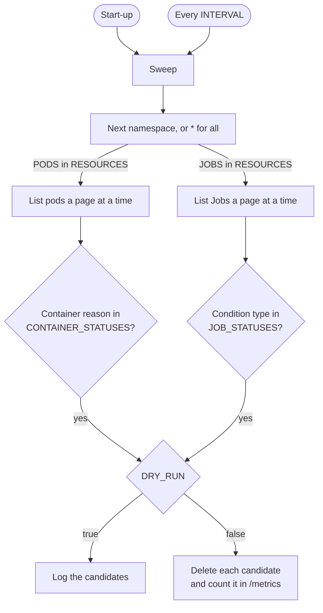

# Architecture

## Sweep loop

The pruner sweeps once at start-up and once every `INTERVAL` after that. [`pruner/pruner.go`](https://github.com/saidsef/pod-pruner/blob/main/pruner/pruner.go) holds the loop. A sweep visits each namespace in `NAMESPACES` in turn, or makes one cluster-wide pass when `NAMESPACES` is unset. In each namespace it handles pods before Jobs, and skips whichever of the two `RESOURCES` leaves out.

Sweeps never overlap. A sweep that runs past `INTERVAL` delays the next one.

If listing pods in a namespace fails, the pruner skips the rest of that namespace, its Jobs included, until the next sweep.

## Pod selection

A pod becomes a candidate when one of its containers matches a reason in `CONTAINER_STATUSES`, by the rules in [Container statuses](./configuration.md#container-statuses). `pruneCandidate` in [`containers.go`](https://github.com/saidsef/pod-pruner/blob/main/pruner/internal/resources/containers.go) makes that decision.

Kubernetes cannot delete a single container, so the pruner deletes the whole pod. A pod with several matching containers counts once. The pruner sends a plain delete, so the pod gets its usual termination grace period. A controller that owns the pod, such as a ReplicaSet, replaces it as it would any other deleted pod.

## Job deletion

A Job becomes a candidate when any of its conditions has a type in `JOB_STATUSES`. The pruner deletes it with background propagation: the API server removes the Job straight away, and the garbage collector removes its pods afterwards.

Job deletions run in parallel, up to the limit `deleteConcurrency` sets in [`jobs.go`](https://github.com/saidsef/pod-pruner/blob/main/pruner/internal/resources/jobs.go). Pod deletions run one after another.

## Kubernetes API access

The pruner builds its client from the in-cluster service account config. `clientQPS` and `clientBurst` in [`auth.go`](https://github.com/saidsef/pod-pruner/blob/main/pruner/internal/auth/auth.go) raise the client-side rate limit above the client-go default of 5 requests a second.

Every list call fetches `listPageSize` objects per page and follows the continue token, so a large namespace never arrives in one response.

## Logging

The pruner writes JSON log lines to standard error through logrus. [Log output](./installation.md#log-output) shows the lines a sweep writes.
